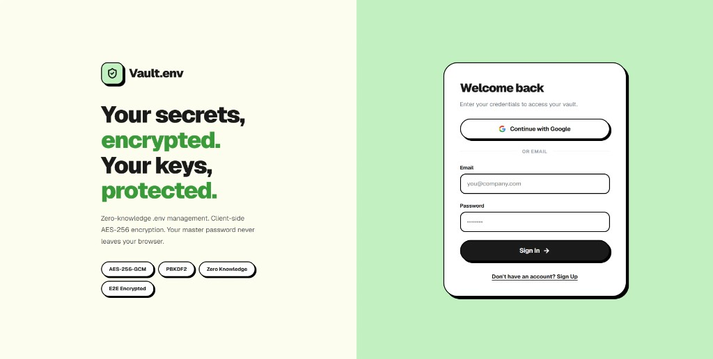
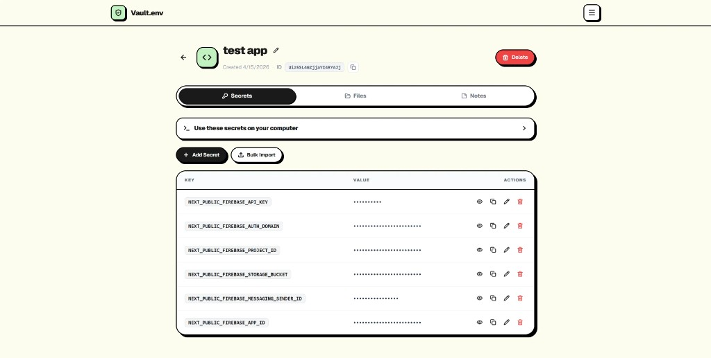
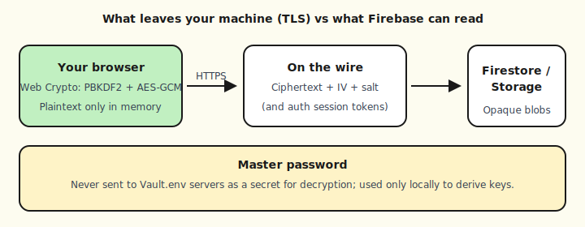
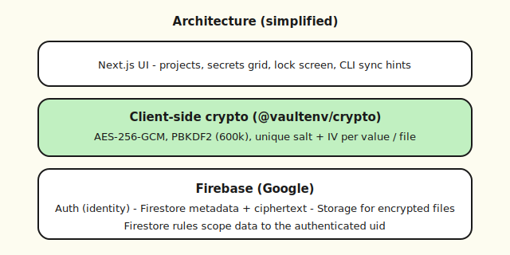

# Vault.env

<p align="center">
  
</p>

<p align="center">
  <strong>Zero-knowledge <code>.env</code> and secret management</strong><br />
  Next.js · Firebase · Web Crypto · CLI
</p>

---

## Case study

### Context

Developers share API keys through chat, tickets, and shared docs. That is fast but brittle: rotation is painful, audit trails are weak, and anyone with inbox access can see production credentials. **Vault.env** is a product-style response: a web app where **encryption runs in the browser**, synced storage holds **ciphertext only**, and a small **CLI** lets you **pull** a `.env` on your machine without teaching the server your master password.

### What the product does

- **Identity** via Firebase Auth (email/password and Google).
- **Vault master password** used only on the client to derive keys (PBKDF2 + AES-256-GCM via Web Crypto).
- **Projects** with **Secrets** (key/value), **Files** (encrypted before upload), and **Notes** (encrypted markdown).
- **Lock screen** and idle timeout so keys do not linger longer than the session.
- **Public marketing site** (blog, contact, legal) with SEO-oriented sitemap and robots.
- **`@vaultenv/cli`** on npm so the same crypto package can **pull/push** secrets against Firestore.

### Product screenshots

**Landing and authentication** — value proposition, tech badges, and sign-in (Google or email).

<p align="center">
  
</p>

**Project workspace** — per-project **Secrets** table (with reveal/copy/edit), **Files** and **Notes** tabs, **CLI** copy-paste block for `npx @vaultenv/cli`, and destructive actions (e.g. delete project) kept obvious and separated.

<p align="center">
  
</p>

---

## Security model (how data is sent and stored)

### Master password and keys

- The **vault master password** never leaves the browser as a secret for server-side decryption.
- Keys are derived with **PBKDF2** (600,000 iterations, SHA-256) and **AES-256-GCM** using the **Web Crypto API**.
- Derived material lives in **memory** for the session (Zustand), not in `localStorage` for the master password.

### What leaves the device (TLS) vs what the backend can read

- **In transit:** HTTPS to Firebase; payloads are ciphertext plus IV/salt metadata as designed.
- **Firebase Auth** sees **account identity** (e.g. email, uid) — required to sync per user.
- **Firestore** stores **ciphertext** for secret values and notes; **secret key names** (e.g. `DATABASE_URL`) and project/file **names** are **plaintext** in the data model so the UI can list and search them.
- **Firebase Storage** holds **encrypted** file bytes for vault files; **project logo** images are stored **unencrypted** by design (public URL for display — documented in privacy copy).





### CLI

- **`@vaultenv/cli`** reuses **`@vaultenv/crypto`** so encryption matches the web app.
- Optional **`--no-store`** avoids saving account credentials under `~/.vault-env/`.

---

## Tech stack

| Area | Choices |
|------|---------|
| **App** | Next.js (App Router), React, TypeScript |
| **Auth & data** | Firebase Auth, Firestore, Storage |
| **Crypto** | Web Crypto in-browser; shared `packages/crypto` for CLI |
| **State** | Zustand |
| **Styling** | Tailwind CSS v4, inline styles where components are bespoke |
| **Deploy** | Netlify (Next runtime, Forms, env) |

---

## Repository map (high level)

- `src/app/` — routes (marketing, dashboard, project workspace, contact, blog).
- `src/lib/crypto.ts` — re-exports `@vaultenv/crypto`.
- `src/lib/firestore.ts` — Firestore and Storage helpers.
- `packages/crypto` — PBKDF2 + AES-GCM shared with CLI.
- `packages/cli` — `vault-env` CLI (`pull` / `push` / `login`, etc.).
- `firestore.rules` / `storage.rules` — deploy to Firebase for production security.

---

## Crawlers and SEO (production)

| Resource | Notes |
|----------|--------|
| **Sitemap** | `/sitemap.xml` from [`src/app/sitemap.ts`](src/app/sitemap.ts) — set `NEXT_PUBLIC_SITE_URL` |
| **Robots** | [`src/app/robots.ts`](src/app/robots.ts) |
| **Extras** | [`public/llms.txt`](public/llms.txt), [`public/.well-known/security.txt`](public/.well-known/security.txt) |

---

## Agent tooling (optional)

- **[AGENTS.md](AGENTS.md)** — notes for AI assistants working in this repo.
- **[CLAUDE.md](CLAUDE.md)** — points at `AGENTS.md`.

---

## For recruiters: run the project locally

These steps assume a **macOS/Linux/WSL** shell or **PowerShell** on Windows and **Node.js 20+**.

### 1. Clone and install

```bash
git clone https://github.com/halanhub/Vault.env.git
cd Vault.env
npm install
```

### 2. Firebase project (required for auth and data)

1. Create a project in the [Firebase console](https://console.firebase.google.com).
2. Enable **Authentication** → **Email/Password** and **Google** (optional but matches the UI).
3. Create a **Firestore** database and **Storage** bucket.
4. Register a **Web app** and copy the config values.

### 3. Environment file

```bash
cp .env.example .env.local
```

Edit **`.env.local`** and set at least:

- `NEXT_PUBLIC_FIREBASE_API_KEY`
- `NEXT_PUBLIC_FIREBASE_AUTH_DOMAIN`
- `NEXT_PUBLIC_FIREBASE_PROJECT_ID`
- `NEXT_PUBLIC_FIREBASE_STORAGE_BUCKET` (usually `your-project-id.appspot.com`)
- `NEXT_PUBLIC_FIREBASE_MESSAGING_SENDER_ID`
- `NEXT_PUBLIC_FIREBASE_APP_ID`

Do **not** commit `.env.local`. It is gitignored.

### 4. Security rules

Deploy rules to the same Firebase project (CLI) or paste them in the console:

```bash
firebase deploy --only firestore:rules,storage
```

Or copy [`firestore.rules`](firestore.rules) and [`storage.rules`](storage.rules) into **Firestore → Rules** and **Storage → Rules**.

### 5. Start the dev server

```bash
npm run dev
```

Open **`https://localhost:3000`** (this repo enables experimental HTTPS for local dev). Accept the certificate warning if the browser prompts you.

### 6. Optional features

- **Billing / Solo checkout (Dodo):** only if you configure the `NEXT_PUBLIC_CHECKOUT_URL`, `DODO_*`, and `FIREBASE_SERVICE_ACCOUNT_JSON` variables from [`.env.example`](.env.example). The core vault works without them.
- **Production build:** `npm run build` then `npm run start`.

### 7. Workspace packages

- **Crypto:** `npm run build -w @vaultenv/crypto` (runs on `postinstall` as well).
- **CLI:** `npm run build -w @vaultenv/cli` — then `npx @vaultenv/cli` or `npm run vault-env` after build.

---

## License

MIT
